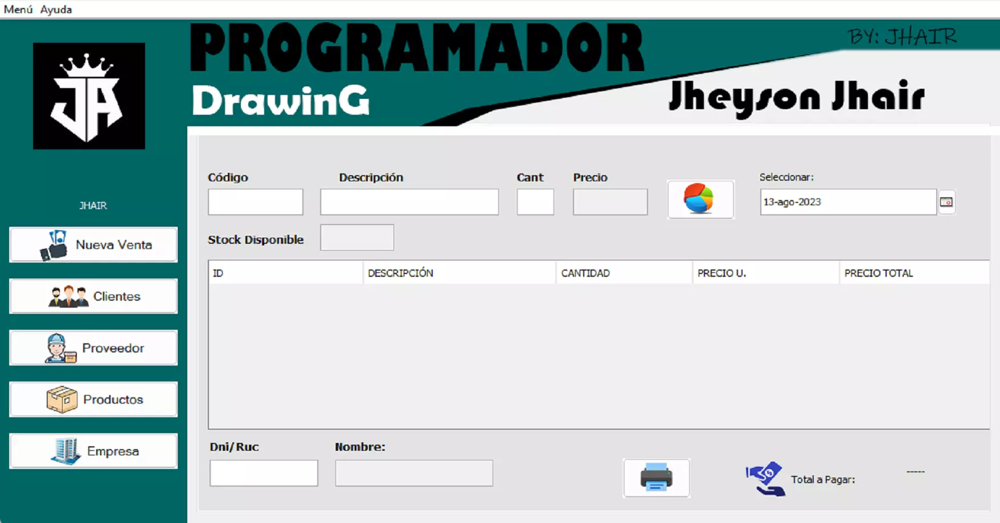

<div align="center">
    <a href="https://github.com/JheysonJhair/app_java_sales-system">
      
    </a>
    <h1>JhairDev - Sistema de Ventas</h1>
    <p align="center">
        Full Stack Developer Jhair
    </p>
</div>



# Sistema de Gestión de Ventas

Bienvenido al **Sistema de Gestión de Ventas**, una solución integral para la administración de ventas, facturación, gestión de productos, clientes y proveedores. Este sistema está diseñado para automatizar procesos clave de ventas y ofrecer reportes detallados de rendimiento.

## Tecnologías Utilizadas

- **Java**: El lenguaje principal utilizado para implementar la lógica del sistema.
- **MySQL**: Base de datos utilizada para gestionar la información de ventas, facturas, productos, clientes y proveedores.
- **Swing (Java)**: Para la creación de la interfaz gráfica de usuario (GUI) que permite la interacción con los datos.

---

## Módulos del Sistema

La aplicación cuenta con los siguientes módulos especializados:

- **Módulo de Factura**: Permite generar, gestionar y almacenar facturas de ventas.
- **Módulo de Productos**: Administra el catálogo de productos disponibles para la venta, con información detallada de cada uno.
- **Módulo de Cliente**: Gestiona la información de los clientes, permitiendo su registro, consulta y seguimiento.
- **Módulo de Proveedor**: Maneja los proveedores que suministran productos o servicios a la empresa.
- **Módulo de Reporte**: Genera reportes detallados de ventas, productos más vendidos, ingresos por cliente, etc., con posibilidad de exportación a formatos como PDF o Excel.

---

## Instalación

1. **Requisitos previos**:
   - Tener instalado **Java JDK 17** o superior.
   - Tener configurado **MySQL** en el sistema con un usuario y una base de datos disponibles.

2. **Clonar el repositorio**:
   ```bash
   git clone https://github.com/JheysonJhair/app_java_sales-system.git
   cd app_java_sales-system

3. **Ejecuta tu entorno de desarrollo para java y abre el proyecto**

4. **Ejecuta la aplicación.**

¡Listo! Ahora puedes comenzar a trabajar en el Sistema sin problemas.
